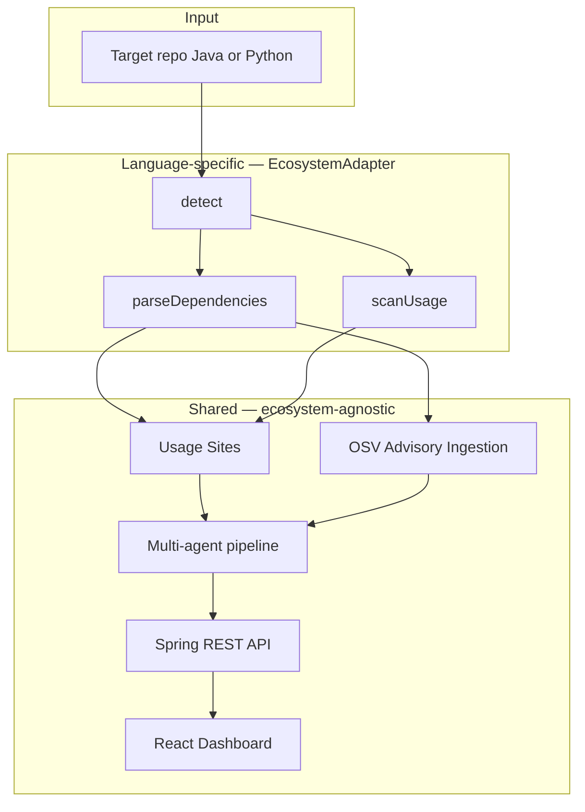

# Architecture

## System overview



## The one seam: `EcosystemAdapter`

Only **two methods** are language-specific:

| Method | Maven | Python (Phase 8) |
|--------|-------|------------------|
| `detect(repo)` | `pom.xml` exists | `requirements.txt` / `pyproject.toml` |
| `parseDependencies(repo)` | Parse `<dependencies>` | Parse pip/poetry manifests |
| `scanUsage(repo, dep)` | Walk `*.java` imports | Walk `*.py` imports |

Everything downstream — advisories, agents, API, UI — stays **unchanged** when you add Python.

```java
public interface EcosystemAdapter {
    String ecosystemId();                              // "maven" | "pypi"
    boolean detect(Path repoRoot);
    List<Dependency> parseDependencies(Path repoRoot);
    List<UsageSite> scanUsage(Path repoRoot, Dependency d);
}
```

## Multi-agent pipeline (Phase 5)

```mermaid
sequenceDiagram
    participant A as Advisory + UsageSites
    participant T as TriageAgent
    participant M as MigrationAgent
    participant E as EvalAgent
    participant DB as Finding

    A --> T
    T -->|relevant| M
    T -->|not relevant| skip
    M --> E
    E -->|faithful| DB
    E -->|not faithful| M
    Note over M,E: Regenerate once, then persist
```

## Package layout

```
com.blastradius
├── model          # JPA entities
├── ingestion      # EcosystemAdapter, MavenAdapter, PythonAdapter
├── analysis       # AnalysisService, usage orchestration
├── agents         # Triage, Migration, Eval + LlmClient
└── api            # REST controllers
```
