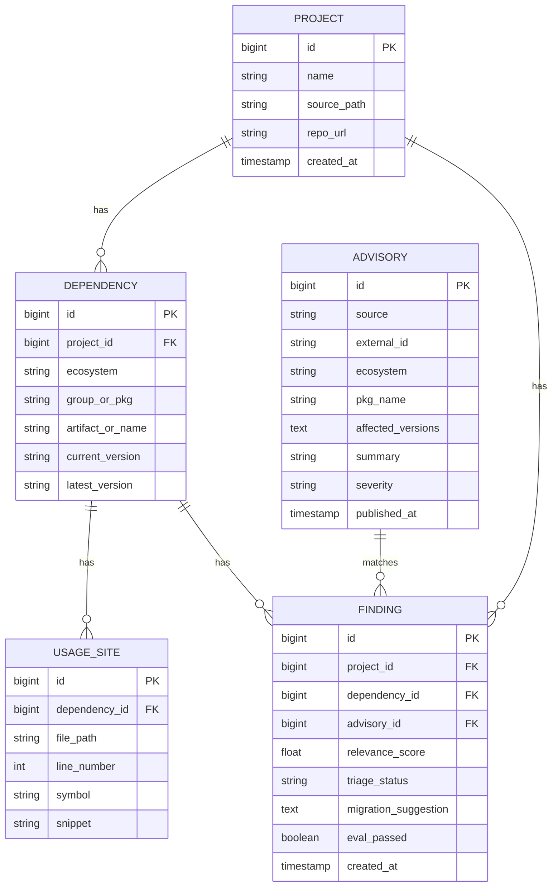

# Data Model

## ER diagram

## Key design notes

- **`ecosystem`** on `Dependency` and `Advisory` is the multi-language seam (`maven`, `pypi`).
- **`Advisory`** is global — not tied to a project. Matched to deps by `ecosystem + package name`.
- **`Finding`** is the product: the join of project + dependency + advisory + agent output.
