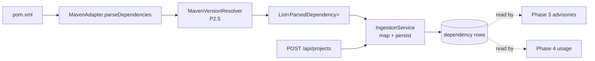

# Phase 2 — Maven Ingestion ✅

**Branch:** `feat/phase2-maven-ingestion` · **Status:** ✅ Complete — ready to merge
**Needs:** [[Phase 1 — Persistence]] ✅ · **Enables:** [[Phase 3 — Advisories]], Phase 4 (usage), Phase 8 (Python)

> [!success] Outcome
> A repo's build manifest (`pom.xml`) is parsed behind a language-neutral **adapter seam** and its dependencies land in the `dependency` table with concrete versions. This is the raw material every later phase reads.

---

## What we built

| Step | Component | What it does |
|------|-----------|--------------|
| 2.1 | `EcosystemAdapter` + `ParsedDependency` | The extensibility **seam**; DTO keeps parsing free of JPA |
| 2.2 | `MavenAdapter` | `detect()` finds `pom.xml`; `parseDependencies()` reads `<dependencies>` |
| 2.3 | `AdapterRegistry` | Auto-collects adapters, selects by `detect()` |
| 2.4 | `IngestionService` | Maps DTO → entity, persists `@Transactional` |
| 2.5 | `POST /api/projects` + DTOs | REST entry: create project, ingest, return deps |
| 2.6 | Unit test + fixture pom | Proves parsing correctness |
| **P2.5** | **`MavenVersionResolver`** | Resolves `${props}`, on-disk parent POMs, `<dependencyManagement>` → concrete versions |
| +IT | `ProjectControllerIntegrationTest` | Proves POST→DB seam **in CI** (H2) |

> [!tip] Why the seam matters
> Adding a new language (Python, npm) later = *write one adapter + register it*. The registry, service, controller, API, and UI never change. That's the "~a day of work per language" claim.

---

## Checkpoint — PASSED ✅

- [x] `mvnw test` → **14/14 green**
- [x] `POST /api/projects` with a real Java repo → deps persist with `ecosystem="maven"`
- [x] Versions resolved from `${properties}` / parent / `dependencyManagement`
- [x] Pushed to `origin/feat/phase2-maven-ingestion` (10 commits)

---

## Known boundary (carry into Phase 3)

> [!warning] The `"unspecified"` version
> Versions that live **only in a remote BOM** (e.g. `spring-boot-starter-parent`) are *not* downloaded, so those deps come back as `current_version = "unspecified"`.
> **Phase 3 rule:** treat `"unspecified"` as *"version-unknown → flag for manual review"* — **never** match every advisory range, or you reintroduce the exact false-positive noise the product removes.

## Follow-ups deferred (not blockers)

- Ingestion isn't idempotent — re-scanning duplicates `dependency` rows. Add a `V2` unique constraint + upsert when re-scans arrive (Phase 3/6).
- Full remote-BOM resolution would need the Maven resolver + network (`mvn dependency:tree`). A Phase 3+ decision.

---

**Next:** [[Phase 3 — Advisories]] · Back to [[Dashboard]] · [[Roadmap]] · [[PROGRESS]]
