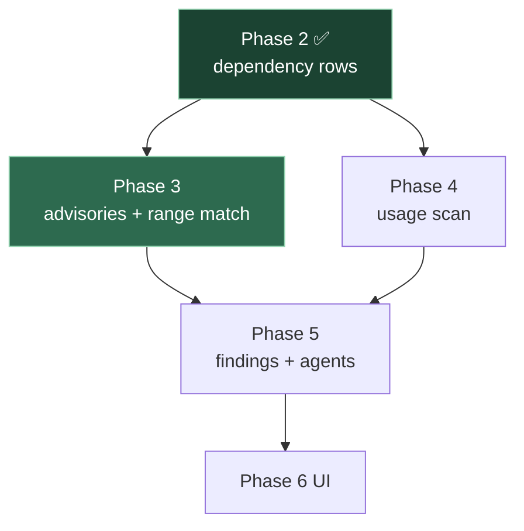

# Phase 3 — Advisory Ingestion 🧠🔧

**Branch:** `feat/phase3-advisories` · **Status:** 🔜 Next up
**Needs:** [[Phase 2 — Ingestion]] ✅ · **Enables:** Phase 5 (findings / agents)

> [!abstract] Goal in one line
> For every dependency we already store, pull known advisories from **OSV.dev**, save them to the `advisory` table, and decide whether *your* installed version is actually in the vulnerable range — the core noise filter.

---

## Where this sits

## Phase 2 → Phase 3 contract

> [!info] What P3 consumes from P2
> | From Phase 2 | Phase 3 uses it to… |
> |---|---|
> | `dependency (ecosystem, group, artifact, current_version)` | Query OSV + **filter by version range** |
> | Concrete versions (P2.5) | Make range filtering meaningful |
> | `"unspecified"` sentinel | Branch → `version-unknown`, flag for review (never match-all) |

---

## Task breakdown

> [!todo] Micro-steps (one commit each)
> - [ ] **3.1** `AdvisoryClient` → OSV `POST /v1/querybatch` from distinct `(ecosystem, pkg, version)`
> - [ ] **3.2** Map OSV JSON → `Advisory` entity (`external_id` UNIQUE = OSV id; ranges → `affected_versions`; `severity`)
> - [ ] **3.3** `AdvisoryService.refreshForProject(projectId)` — query + **upsert / dedupe** on `external_id`
> - [ ] **3.4** Version-range check helper — is `current_version` inside an OSV affected range? (`"unspecified"` → skip + flag)
> - [ ] **3.5** `POST /api/projects/{id}/advisories/refresh` → returns advisory count
> - [ ] **3.6** Unit tests — OSV JSON fixture → advisories parsed; range check true/false cases
> - [ ] **Checkpoint** — refresh a real project → `advisory` rows land; a dep with a known CVE matches by range
> - [ ] Push → PR → merge

## Design notes

| Concern | Decision |
|---|---|
| Data source | [OSV.dev](https://osv.dev) REST API — free, multi-ecosystem (Maven + PyPI later) |
| Ecosystem mapping | our `"maven"` → OSV `"Maven"` |
| Dedupe | `advisory.external_id` UNIQUE → upsert, never duplicate |
| Storage | `affected_versions` holds OSV range JSON as-is; parse on read |
| No-version deps | `"unspecified"` → create finding as `version-unknown`, do **not** auto-match |

---

## Roadblocks to watch

> [!danger] Version-range comparison is the hard part
> OSV encodes ranges as `SEMVER` **or** `ECOSYSTEM` events (`introduced` / `fixed`). Maven versions don't follow semver. Budget real time for a correct comparator + tests; this is where subtle false positives/negatives hide.

> [!warning] Rate limits & network
> OSV calls hit the network. Use `querybatch` (one call for many packages), and make `refresh` idempotent so re-runs are cheap and safe.

---

## Definition of done

- [ ] `advisory` table populated for a real project
- [ ] Range filter correctly separates *affected* vs *not-affected* versions
- [ ] `"unspecified"` deps flagged, not spammed
- [ ] Tests green in CI · PR merged to `main`

---

**Prev:** [[Phase 2 — Ingestion]] · **Next:** Phase 5 (findings) · [[Roadmap]] · [[Dashboard]] · [[PROGRESS]]
