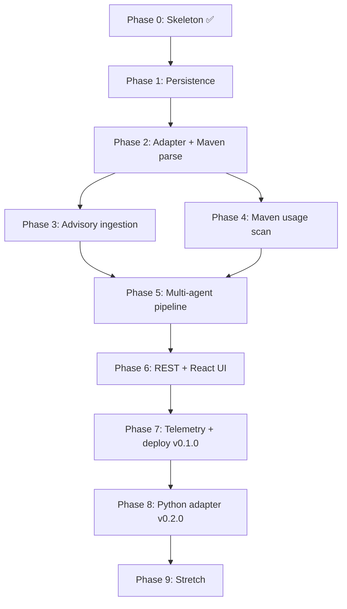

# Roadmap — Phases & Dependencies

## Phase dependency graph

**Critical path:** P0 → P1 → P2 → (P3 + P4 in parallel) → P5 → P6 → P7 → P8

P3 and P4 are **independent** after P2 — build in either order or parallel sessions.

P5 is the **first convergence** — needs both advisories AND usage sites.

---

## All phases (summary)

| Phase | Name | Type | Needs | Enables | Tag |
|-------|------|------|-------|---------|-----|
| **0** | Spring Boot skeleton + `/health` | 🔧 | JDK 21 | Everything | — |
| **1** | PostgreSQL + JPA + Flyway + entities | 🔧 | P0 | All ingestion/analysis | — |
| **2** | `EcosystemAdapter` + Maven `parseDependencies` | 🧠🔧 | P1 | P3, P4, P8 | — |
| **3** | OSV advisory ingestion (Maven + PyPI) | 🧠🔧 | P2 | P5 | — |
| **4** | Maven `scanUsage` (import/symbol) | 🧠 | P2 | P5 | — |
| **5** | Triage → Migration → Eval agents | 🧠 | P3 + P4 | P6 | — |
| **6** | REST API + React dashboard | 🔧 | P5 | P7 | — |
| **7** | Telemetry + Railway/Vercel deploy | 🔧 | P6 | P8 | **v0.1.0** |
| **8** | `PythonAdapter` (pypi) | 🧠 | P7 | Two-lang demo | **v0.2.0** |
| **9** | Stretch: GitHub clone, Kafka, AST | — | P8 | — | — |

🧠 = substance (review every line) · 🔧 = boilerplate (Cursor can drive)

---

## Three-week plan

| Week | Phases | Outcome |
|------|--------|---------|
| 1 | 1, 2, 3 | Adapter + Java parsing + advisories |
| 2 | 4, 5 | Usage detection + agent pipeline E2E |
| 3 | 6, 7 | Dashboard + deployed **v0.1.0** |
| 4 (buffer) | 8 | Python adapter → **v0.2.0** |

---

## Micro-steps checklist (Phase 1 — current)

- [ ] 1.1 Postgres Docker command in README
- [ ] 1.2 JPA + Postgres + Flyway deps + datasource config
- [ ] 1.3 Five entities under `com.blastradius.model`
- [ ] 1.4 JPA repository per entity
- [ ] 1.5 Flyway `V1__init.sql`
- [ ] Checkpoint: app boots, tables visible in IntelliJ DB tool
- [ ] Push branch → PR → merge

See [[Phase 1 — Persistence]] for details.
