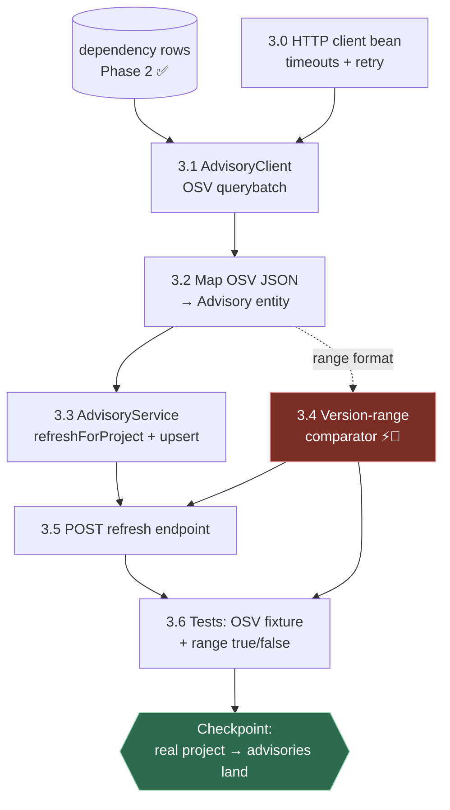
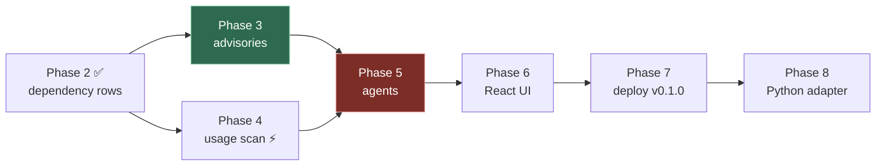

# Task Dependency Map 🗺️

> [!abstract] What this note is
> Every remaining task, **who blocks whom**, and which items are *cross-functional* (built in one phase but consumed by a later one). Use this to pick what to work on next without hitting a wall.

**Status as of 2026-08-11:** Phases 0–2 ✅ merged (`main` @ PR #3). Phase 3 not started.

---

## Legend

| Symbol                  | Meaning                                                                               |
| ----------------------- | ------------------------------------------------------------------------------------- |
| 🔒 **Blocking**         | Nothing downstream can start until this is done                                       |
| ⚡ **Parallel**          | Can be built at the same time as its siblings                                         |
| 🔗 **Cross-functional** | Built here, but a *later* phase depends on it — get the contract right the first time |
| 💤 **Deferred debt**    | Known gap, safe to postpone, has a named deadline phase                               |

---

## Task graph — Phase 3 (next)



### Phase 3 task table

| # | Task | Depends on | Type | Notes |
|---|------|-----------|------|-------|
| **3.0** | HTTP client bean (`RestClient`), timeouts, base URL config | — | 🔒 | Small but blocks 3.1. Don't skip timeouts — OSV is a network call |
| **3.1** | `AdvisoryClient` → OSV `POST /v1/querybatch` | 3.0 | 🔒 | Batch, not per-dep: one call for many packages |
| **3.2** | Map OSV JSON → `Advisory` (`external_id`, ranges, severity) | 3.1 | 🔒 | `external_id` UNIQUE already exists in schema ✅ |
| **3.3** | `AdvisoryService.refreshForProject()` + upsert/dedupe | 3.2 | 🔒 | Must be idempotent — re-running must not duplicate |
| **3.4** | **Version-range comparator** | (3.2 for format) | ⚡🔗 | **Pure function — build & test in parallel from day one.** Consumed by Phase 5 |
| **3.5** | `POST /api/projects/{id}/advisories/refresh` | 3.3, 3.4 | — | Returns advisory + match counts |
| **3.6** | Tests: OSV JSON fixture + range true/false cases | 3.2, 3.4 | — | Mock the HTTP call; never hit live OSV in CI |

> [!danger] 3.4 is the risk concentrate
> OSV encodes ranges as `SEMVER` **or** `ECOSYSTEM` events (`introduced` / `fixed`). **Maven versions are not semver** (`1.0-RC1`, `2.0.0.RELEASE`, `3.12.0`). A naive comparator silently produces wrong verdicts in *both* directions. Build it standalone, table-test it hard, and treat it as the highest-value unit test in the repo.

> [!warning] The `"unspecified"` branch is mandatory
> Deps whose version came back `"unspecified"` (remote-BOM case P2.5 can't reach) **must** route to a *version-unknown / manual-review* outcome. Never auto-match them against all ranges — that reintroduces the exact false-positive noise this product removes.

---

## Cross-phase dependency map



**P3 and P4 are independent** — both only need Phase 2's `dependency` rows. Build in either order, or interleave when one gets tedious.

**P5 is the first convergence point** — it needs advisories (P3) *and* usage sites (P4). It cannot start until both land.

### Critical path

```
P2 ✅ → max(P3, P4) → P5 → P6 → P7 → P8
```

Doing P3 and P4 in parallel doesn't shorten a solo-developer timeline, but **P4 is the better fallback task** when P3's range comparator gets frustrating — it keeps momentum without blocking anything.

---

## 🔗 Cross-functional items (get the contract right now)

These are built in one phase but *consumed* later. Mistakes here cause rework:

| Item | Built in | Consumed by | Contract to honour |
|---|---|---|---|
| Version-range comparator | 3.4 | **P5** triage agent, P6 UI badges | Return a tri-state: `AFFECTED` / `NOT_AFFECTED` / `UNKNOWN` — not a boolean |
| `"unspecified"` handling | P2.5 → 3.4 | P5 `finding.triage_status` | Maps to a distinct status, surfaced in UI as "needs manual review" |
| `advisory.external_id` UNIQUE | P1 ✅ | 3.3 upsert | Dedupe key across refreshes — never mutate |
| `EcosystemAdapter.ecosystemId()` | P2 ✅ | 3.1 OSV query, P8 Python | Map `"maven"` → OSV `"Maven"`, `"pypi"` → `"PyPI"` |
| `scanUsage()` interface slot | P2 ✅ (stub) | **P4** fills it | Signature already fixed — P4 is a fill-in, not a redesign |
| `finding` table (3 FKs) | P1 ✅ | P5 writes, P6 reads | project × dependency × advisory is the join grain |

---

## 💤 Deferred debt (with deadlines)

| Debt | Impact | Must fix by |
|---|---|---|
| Ingestion not idempotent — re-POSTing a project duplicates `dependency` rows | Duplicate advisories/findings downstream | **Before P6** (UI triggers re-scans). Needs `V2` migration: UNIQUE `(project_id, ecosystem, group_or_pkg, artifact_or_name)` + upsert |
| Remote-BOM versions unresolved (`"unspecified"`) | Reduced coverage on Spring Boot–style targets | Optional; revisit after P5 proves the pipeline. Full fix = Maven resolver + network |
| No `@Valid` / `@NotBlank` on request DTOs | Cosmetic; service-layer guard exists | Any time — good warm-up task |
| Two doc commits stranded off `main` | Obsidian pages missing on GitHub | Next PR |

---

## What to do next (ordered)

> [!todo] Immediate
> - [ ] Land the stranded doc commits + this map on `main` (small PR)
> - [ ] Cut `feat/phase3-advisories` from updated `main`
> - [ ] **3.0** HTTP client bean
> - [ ] **3.1** `AdvisoryClient` (OSV querybatch)
> - [ ] **3.4** Start the range comparator in parallel — it's the long pole

---

**See also:** [[Phase 3 — Advisories]] · [[Phase 2 — Ingestion]] · [[Roadmap]] · [[PROGRESS]] · [[Dashboard]]
